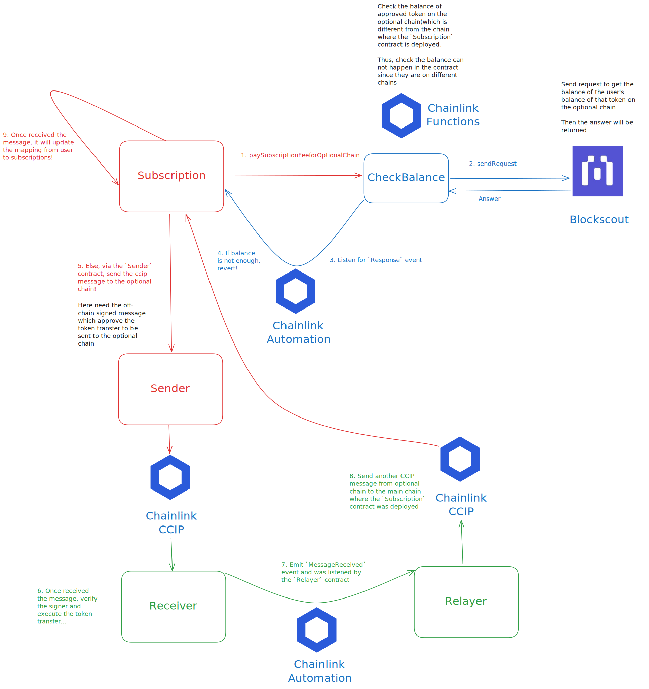

## About the Project

ChainSync is a subscription system where user can pay the subscription fee on different chains with the help of Chainlink CCIP.

The user can decide which chain to pay the subscription fee on. => Primary payment chain and optional payment chain(s).

- if the user pays the subscription fee on the primary chain, which is where the `Subscription` contract is deployed, it will be simple payment process.
- if the user pays the subscription fee on the optional chain, the payment process will be a bit complex. As shown below:

### Process of optional chain payment:

Role of each contract in the process:

- `Subscription` contract: The contract where the user subscribes to the service.
- `CheckBalance` contract: The contract which send an API request to the `Blockscout` service to check the balance of the user's token on the optional chain.
- `Sender` contract: The contract which sends the cross-chain message to the `Receiver` contract on the optional chain.
- `Receiver` contract: The contract which receives the cross-chain message from the `Sender` contract and do the actual transfer process.
- `Relayer` contract: The contract which listens for `MessageReceived` event from the `Receiver` contract and sends another cross-chain message back to the `Subscription` contract to update the user's subscription status.



---

## Built With

- Solidity
- OpenZeppelin
- Foundry
- Blockscout
- Chainlink (CCIP, Functions, Automation)

## Getting Started

### Prerequisites

- [git](https://git-scm.com/book/en/v2/Getting-Started-Installing-Git)
  - You'll know you did it right if you can run `git --version` and you see a response like `git version x.x.x`
- [foundry](https://getfoundry.sh/)
  - You'll know you did it right if you can run `forge --version` and you see a response like `forge 0.2.0 (816e00b 2023-03-16T00:05:26.396218Z)`

### Quickstart

```
git clone https://github.com/cqlyj/ChainSync.git
cd ChainSync
make
```

## Usage

### Deployment sequence

1. First set up your environment variables in the `.env` file.

```
cp .env.example .env
```

2. In `Makefile`, update the `--account burner --sender 0xFB6a372F2F51a002b390D18693075157A459641F` to your own account.

```
*** --account <your-account-name> --sender <your-account-address> ***
```

3. In the `Subscription.sol` contract, update the `AMOY_SUBSCRIPTION_ID` variable to your own subscription ID of Chainlink functions. Also update those variables that are related to your own values, you can search those by inputting `@notice update` and update those values.

4. Follow the sequence below to deploy the contracts:

```
make deploy-sender
make deploy-checkBalance
make deploy-receiver
make deploy-subscription
make deploy-relayer
```

### Interacting with the contracts

Before interacting with the contracts, update those variables that are related to your own values in the script and then run the following commands:

```
make add-consumer
make add-linkTokenToReceiver
make add-linkTokenToRelayer
make add-linkTokenToSender
make approve-receiverToSpendCCIPBNM
make transfer-ownershipToSubscription
make get-signedMessage
```

Grab the signedMessage and update this in the `script/PaySubscriptionFeeForOptionalChain` contract.
Set up your Chainlink Automation services and after everything is set up, run the following command:

```
make pay-subscriptionFeeforOptionalChain
```

You now have successfully paid the subscription fee on the optional chain.

## Testing

```
forge test
```

## Test Coverage

```
forge coverage
```

and for coverage based testing:

```
forge coverage --report debug
```

## Static Analysis

### Slither

```
make slither
```

### Aderyn

```
make aderyn
```

## How to Contribute

We welcome contributions to ChainSync! Here's how you can help:

### Types of Contributions

- **Bug Reports**: Open an issue describing the bug, including steps to reproduce, expected behavior, and actual behavior
- **Feature Requests**: Submit an issue describing the new feature and its potential benefits
- **Code Contributions**: Submit pull requests for bug fixes or new features
- **Documentation**: Help improve or translate our documentation
- **Testing**: Add more test cases or help identify test coverage gaps

### Development Process

1. Fork the repository and create your branch from `main`:

   ```
   git checkout -b feature/your-feature-name
   ```

2. If you've added code, add tests that cover your changes:

   ```
   forge test
   ```

3. Ensure your code follows the project's style guidelines:

   ```
   make slither
   make aderyn
   ```

4. Make sure all tests pass:

   ```
   forge coverage
   ```

5. Update the documentation if necessary

### Pull Request Process

1. Update the README.md with details of changes if applicable
2. Follow the existing code style and formatting
3. Include comments in your code where necessary
4. Add or update tests for any new functionality
5. Reference any relevant issues in your PR description
6. The PR must pass all CI checks and receive approval from a maintainer

### Commit Guidelines

- Use clear and meaningful commit messages
- Reference issue numbers in commit messages when applicable
- Keep commits focused on single changes
- Use present tense ("Add feature" not "Added feature")

### Code of Conduct

- Be respectful and inclusive in your interactions
- Focus on constructive feedback
- Help maintain a positive environment for all contributors

### Questions or Need Help?

Feel free to reach out if you have questions or need guidance:

- Open a GitHub issue for project-related questions
- Contact Luo Yingjie at [luoyingjie0721@gmail.com](luoyingjie0721@gmail.com) for other inquiries

Your contributions help make ChainSync better for everyone. Thank you for your interest in contributing!

## License

This project is licensed under the MIT License - see the [LICENSE](LICENSE) file for details.
